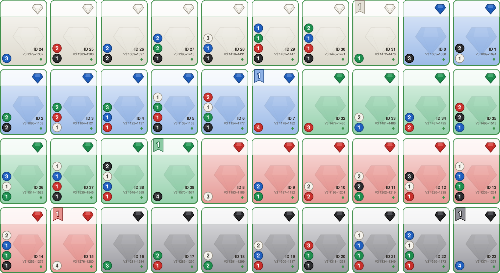
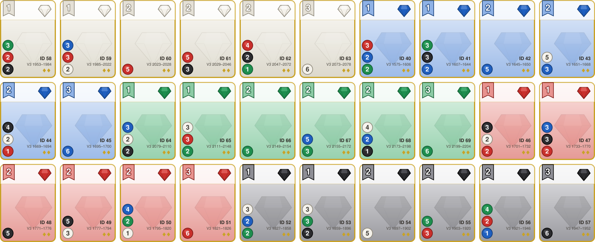
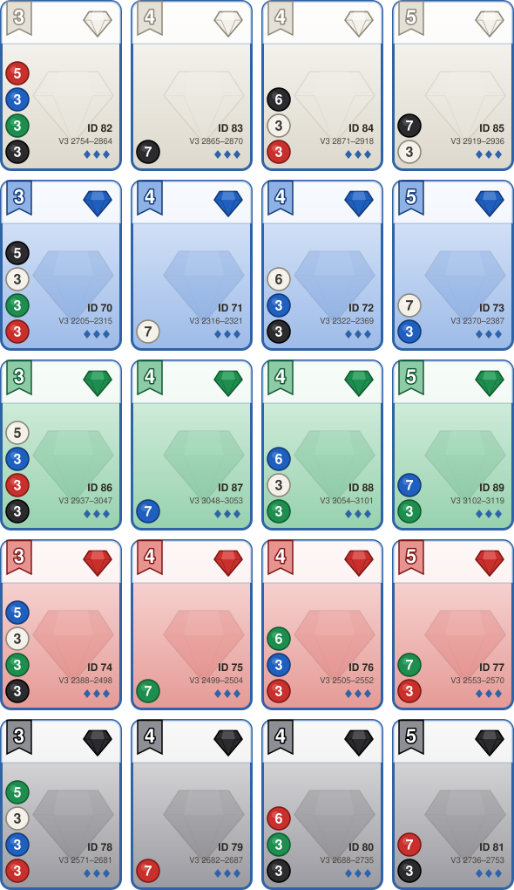
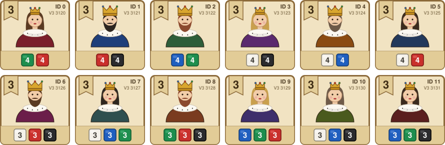

[English](README.en.md)

# csplendor

Splendorの**2人対戦用ルールエンジン**です。C++17の合法手生成・局面更新・探索をPythonから利用できます。AIの学習環境、対局管理、棋譜再生、Webサービスのルール判定に使えます。

このリポジトリはエンジンとPython/API補助を管理します。学習済みモデル、学習実験、ブラウザGUI、対戦サービスの認証・運用基盤は別プロジェクトで実装します。USI仕様の正本は [usi](https://github.com/kuboyoo/usi) です。

## 目次

- [必要環境](#必要環境) / [セットアップ](#セットアップ)
- [サンプルコード](#サンプルコード)
- [速度ベンチマーク](#速度ベンチマーク)
- [ゲームルールと合法手生成モード](#ゲームルールと合法手生成モード)
- [色・カード・貴族の仕様](#色カード貴族の仕様)
- [AI向けの特徴量・行動空間・探索](#ai向けの特徴量行動空間探索)
- [局面保存・非公開情報・棋譜](#局面保存非公開情報棋譜)
- [USIプロトコル](#usiプロトコル)
- [Web APIと対戦サービスへの組み込み](#web-apiと対戦サービスへの組み込み)
- [テスト・詳細資料](#テスト詳細資料)

## 必要環境

| 項目 | 要件 |
|---|---|
| Python | 3.8以上（[パッケージ定義](pyproject.toml)） |
| C++ | C++17対応コンパイラ。LinuxはGCC/Clang、macOSはClang、WindowsはMSVC |
| ビルド | CMake 3.13以上、setuptools 68以上、wheel、pybind11 2.10以上 |
| 実行時 | NumPy 1.20以上 |
| Web API（任意） | `[web]` extra: FastAPI、Uvicorn、Pydantic、HTTPX |
| 開発（任意） | `[dev]` extra: pytest、coverage、Ruffなど |

`pip`はPythonの依存関係とビルド依存を導入します。C++コンパイラは事前に用意してください。ルールエンジン単体にGPUやPyTorchは不要です。

## セットアップ

```bash
git clone https://github.com/kuboyoo/csplendor.git
cd csplendor
python -m venv .venv
source .venv/bin/activate
# Windows PowerShell: .venv\Scripts\Activate.ps1
python -m pip install --upgrade pip
python -m pip install -e .
```

Web APIと開発ツールも使う場合:

```bash
python -m pip install -e '.[dev,web]'
python -c 'import csplendor as cs; print(cs.Game(seed=42).legal_action_count)'
```

C++を変更した場合は `python -m pip install -e .` を再実行して拡張をビルドします。既定はRelease・`portable`です。配布用wheelは次で作成できます。

```bash
python -m pip wheel . --no-deps --wheel-dir dist
```

`CSPLENDOR_CPU_TARGET=native` はApple Siliconのローカル最適化用です。配布wheelでは `portable` を使います。architectureやdeployment targetの指定は [macOSビルド設定](doc/building.md) を参照してください。

## サンプルコード

### 初期化・合法手生成・着手・保存

```python
import csplendor as cs

# 同じエンジン版・seedで同じ初期配置。seed=0も固定seedです。
game = cs.Game(seed=42)
game.simple_payment_mode = False  # 全支払いを列挙する上級者相当

legal = game.legal_actions
print("手番:", game.current_player, "合法手数:", len(legal))
action = legal[0]
assert game.is_legal(action)
assert game.apply(action)         # 不正な着手は適用しない
print("得点:", game.scores)

snapshot = game.serialize_snapshot()
restored = cs.Game.deserialize_snapshot(snapshot)
assert restored.serialize_snapshot() == snapshot
```

`legal_actions` はPythonの `Action` 一覧、`legal_action_codes` はpacked整数一覧、`legal_action_count` は件数だけを返します。**一覧内の添字、packed整数、後述のV3/V4行動IDは別物**です。外部入力には検証付きの `apply()` / `apply_action_code()` を使い、`*_trusted()` は同じ局面で生成済みの合法手に限定してください。

### ランダム対局

```python
import random
import csplendor as cs

rng = random.Random(7)
game = cs.Game(seed=42)
game.simple_payment_mode = True

# 無限対局を避けるアプリ側の上限。上限到達自体はエンジンの引き分け判定ではありません。
for _ in range(500):
    if game.is_game_over():
        break
    assert game.apply(rng.choice(game.legal_actions))

print("終了:", game.is_game_over(), "勝者:", game.winner, "得点:", game.scores)
```

貴族選択待ちでは同じプレイヤーが続けて行動します。通常手がない場合の `PASS` も合法手一覧に含まれるため、このループで処理できます。

### AI入力とV4行動マスク

```python
import numpy as np
import csplendor as cs

game = cs.Game(seed=42)
game.simple_payment_mode = False
observer = game.current_player
features = cs.StateFeaturizer().featurize(game, observer=observer)
mask = cs.ActionEncoderV4.get_action_mask(game)
assert features.shape == (196,)
assert mask.shape == (3121,)

# ここをモデルのマスク付きpolicy選択に置き換える
action_id = int(np.flatnonzero(mask)[0])
action = cs.ActionEncoderV4.decode(action_id, game)
assert game.apply(action)
```

合法手のV4 IDを `game.legal_actions` と同じ順で並べたものは、`cs.ActionEncoderV4.legal_action_ids(game)` で一括取得できます（V3は `cs.ActionEncoderV3.legal_action_ids(game)`）。戻り値は int32 の NumPy 配列で、`[cs.ActionEncoderV4.encode(a, game) for a in game.legal_actions]` と同じ内容をネイティブ側で1回の列挙により作ります。

## 速度ベンチマーク

以下は**保存済みの測定結果**です。「回/秒」は局面1個の合法手生成などを1回と数え、生成した個々の手の数ではありません。

### V3探索・行動符号化（2026-10-04）

ホットスポット高速化（main `0088f76` → `c35062d`）の測定です。探索結果・特徴量・行動IDは比較元とビット一致します。Ryzen 9 7900X、Linux x86_64、GCC 15.2、Python 3.12.1、portable Release。別の学習ジョブが並走している条件で測っています。

| 処理 | 比較元 | 高速化後 | 速度比 | 条件 |
|---|---:|---:|---:|---|
| `V3SearchSession`（決定化あり） | 111,601 sim/s | 157,477 sim/s | 1.41倍 | 48局×400探索、葉batch 32、Pythonから呼出し、NN推論を含まない |
| `V3SearchSession`（決定化なし） | 116,567 sim/s | 152,908 sim/s | 1.31倍 | 同上 |
| `V3SearchSession` 16スレッド | 99,574 sim/s（逐次） | 798,148 sim/s | 8.0倍 | 64局×400探索、`num_threads=16` |
| V3合法手マスク | 3,616 ns | 2,692 ns | 1.34倍 | `midgame_250`、CPU1コア固定 |
| `ActionEncoderV3.legal_action_ids` | 14.11 µs | 0.72 µs | 約20倍 | 比較元はPythonで1手ずつ `encode` |
| `Game.deserialize_snapshot` | 1,959 ns | 618 ns | 3.2倍 | 184バイトのsnapshot |

各処理の測定値や、採用しなかった案は [ベンチマーク資料](doc/performance_benchmarks.md) と [高速化レビュー](doc/speed_review_20261004.md) にまとめています。

### 合法手生成・特徴量・詰み探索

2026-09-06の高速化候補（F1計測コード `b202e6a`）の測定です。Ryzen 9 7900X、Linux x86_64、GCC 15.2.0、Python 3.12.1、portable Release、CPU 1論理コア固定。比較元は当時のmain `f5ec6c5` です。

| 処理 | F1候補の測定値 | 比較元に対する速度比 | 条件 |
|---|---:|---:|---|
| C++合法手の件数取得 | 3,112,938 回/秒 | 2.629倍 | `midgame_250`、20万回、正式系列 |
| C++ packed合法手生成 | 378,400 回/秒 | 2.438倍 | 同上 |
| C++ Action生成 | 346,226 回/秒 | 2.008倍 | 同上。Python object生成を含まない |
| Python `StateFeaturizer` | 29.04 ms / 5万回 | 12.808倍 | `reachable_32_seed42`、独立再測定 |
| Python特徴量＋環境step | 89.37 ms / 5万手 | 6.044倍 | 同上 |
| 厳密めくれ詰み探索 | 1,051.16 ms / 100万node上限 | 2.373倍 | `hidden_reserve`、depth 7、独立再測定 |

詰み探索行はnode上限で `UNKNOWN` になる固定仕事で、7手詰めの証明所要時間ではありません。倍率は対応する測定組の比を集計したもので、表示時間の単純な比とは一致しない場合があります。

高速化は後にmainへ統合されていますが、F1と最終版は同一バイナリではありません。CI互換版との限定solver比較では明確な退行を検出していない、という範囲の結果です。[測定条件・信頼区間・原記録](doc/performance_benchmarks.md) を参照してください。

### Python操作・自己対戦・MCTSの参考値

| 処理 | 測定値 | 測定時点・条件 |
|---|---:|---|
| Python `game.legal_actions` | 27,084 回/秒 | 2026-08-30、合法手250件の局面 |
| C++内部適用の自己対戦 | 892,607 moves/sec | 2026-08-30、Pythonからnative適用を呼ぶ測定 |
| MCTS exact / legacy / 1 thread | 387,132 sim/s | 2026-08-04、待ち時間ゼロのnative evaluator |
| MCTS exact / root-parallel / 8 workers | 1,418,195 sim/s | 同上 |
| MCTS determinized / root-parallel / 8 workers | 1,584,560 sim/s | 同上 |

こちらは9月の高速化候補の再測定ではありません。MCTS値はNN推論を含まず、実モデル・GPU・通信を含む対戦サービスのスループットとは区別します。再現コマンドと詳細は [ベンチマーク資料](doc/performance_benchmarks.md) にまとめています。

## ゲームルールと合法手生成モード

### 2人用ルール

| 項目 | 実装仕様 |
|---|---|
| プレイヤー | 0、1の2人。0から開始 |
| 初期トークン | 白・青・緑・赤・黒が各4、金が5 |
| 公開カード | レベル1〜3を各4枚。初期山札残数は36・26・16 |
| 貴族 | 定義済み12種類から3枚を選出 |
| 所持上限 | トークン合計10、予約カード3枚 |
| 終了条件 | 手番終了時に15点以上で最終ラウンド。後手の手番終了まで進める |
| 勝敗 | 得点が高い方。同点なら購入枚数が少ない方。それも同じなら引き分け |
| `winner` | `-1`: 継続中、`0` / `1`: 勝者、`-2`: 引き分け |

異色取得は銀行にある色から最大3色を1個ずつ、同色2個取得は銀行にその色が4個以上ある場合に可能です。金は通常取得できず、予約時に銀行にあれば1個得ます。取得・公開予約で10個を超える場合、超過分の返却までを1個の `Action` に含めます。山札予約は返却を含まず、11個になった場合は同じ手番のまま返却フェーズ（`waiting_return=True`）に入り、めくれたカードを見てから `RETURN_GEM` で1個返します。返却後に貴族判定を行います。

通常行動後に条件を満たす貴族が1枚なら自動取得、複数なら `waiting_noble=True` となり、同じ手番で `VISIT_NOBLE` を選びます。条件判定は購入済みカードのボーナスで行い、トークンは消費しません。通常の合法手がない場合だけ `PASS` を生成し、相手も行動不能なら引き分けにします。詳細は [エンジン仕様](doc/engine_specs.md)。

### カジュアル相当・上級者相当

BGAでいう支払い方の選択に対応する設定は `Game.simple_payment_mode` です。ここでの呼称は支払い列挙の対応関係を示し、BGA全体との完全なルール互換性を保証するものではありません。

| モード | 設定 | 購入時の合法手 |
|---|---|---|
| カジュアル相当 | `True` | 色トークンを優先し、不足分だけ金で払う1通り |
| 上級者相当 | `False` | 色トークンを温存する金払いも含め、有効な全パターン |

**Python/C++の `Game` の既定値は `False`、HTTP `POST /game` の既定値は `True` です。** 対局開始時に明示し、両AI・サーバー・棋譜で統一してください。簡易モードでもトークン返却の選択肢は複数残ります。

割引後に白2・青1が必要で、白2・青1・金1を持っている場合、簡易モードは白2＋青1の1手です。通常モードは、それに白1＋青1＋金1、白2＋金1を加えた3手です。`gold_as=[1,0,0,0,0]` は「白1個分を金で支払う」を表します。

### Actionのフィールド

| フィールド | 意味 |
|---|---|
| `type` | `0`: 異色取得、`1`: 同色取得、`2`: 公開予約、`3`: 山札予約、`4`: 購入、`5`: 貴族選択、`6`: パス、`7`: 山札予約後の返却（`RETURN_GEM`） |
| `take`, `return_gems` | 色順に6要素。取得数・返却数 |
| `card_id`, `from_reserved` | 対象カードID、予約からの購入か |
| `deck_level` | 山札予約のレベル添字 `0..2`。USIの `L1..L3` とは1ずれる |
| `gold_as` | 白・青・緑・赤・黒の5要素。各色を金で何個代替するか |
| `noble_choice` | 貴族ID。場の並び順の添字ではない |

値の詳細とAPIは [Python API](doc/api_ref.md)、支払いの網羅性は [支払いテスト](tests/test_payment.py) を参照してください。解析用の `blank_refill_mode` は通常対局では `False` のままにします。

## 色・カード・貴族の仕様

### 色IDと配列順

| ID | 色 | `GemType` | USI記号 |
|---:|---|---|---|
| 0 | 白 | `DIAMOND` | `W` |
| 1 | 青 | `SAPPHIRE` | `U` |
| 2 | 緑 | `EMERALD` | `G` |
| 3 | 赤 | `RUBY` | `R` |
| 4 | 黒 | `ONYX` | `K` |
| 5 | 金 | `GOLD` | `D` |

`cost`・`requirement`・`bonuses`・`gold_as` は金を含まない5要素、`bank`・`gems`・`take`・`return_gems` は金を含む6要素です。表示用 `GEM_SYMBOLS` とUSI用 `GEM_USI_SYMBOLS` は別の記号体系です。

### カード90枚

カードのIDは静的データのIDで、場のスロットや行動IDではありません。カードの `level` は `1..3`、場の配列は `board.visible[level - 1][slot]` です。空きスロットは `-1`。

各行が1色（上から白・青・緑・赤・黒）で、表示サイズはレベル間でそろえています。カードの見方: 左上のラベルが勝利点（0点は非表示）、右上の宝石が購入後に得るボーナスの色、左下の丸が購入コスト（数の大きい順）です。右下の `ID` がカードID（0〜89）、`V3 a–b` はV3行動空間でこのカードを購入する行動IDの範囲です（支払いパターンごとに1つ。V4では各値から18を引きます）。枠の色と◆の数がレベルを表します。

**レベル1（40枚）**



**レベル2（30枚）**



**レベル3（20枚）**



1枚ずつの画像は `assets/cards/card_XX.svg`（XXはカードID）です。

**全90枚のID・色・得点・5色コスト表**は [カード・貴族カタログ](doc/card_catalog.md) にあります。正本は [src/card_data.h](src/card_data.h) です。

```python
import csplendor as cs

card = cs.get_card(0)
print(card.id, card.level, card.points, card.bonus, list(card.cost))
# ID 0: レベル1、0点、青ボーナス、コスト [0, 0, 0, 0, 3]
assert len(cs.get_all_cards()) == 90
assert len(cs.get_all_nobles()) == 12
```

### 貴族12種類

このエンジンが採用するカタログは12種類です。すべて3点で、タイル下部のボーナス枚数（購入済みカードの色）を要求します。右上の `ID` が貴族ID、`V3` はV3行動空間でその貴族を選ぶ行動IDです（V4では18を引きます）。外部サービスのIDと同一とは限らないため、連携時は要求色・枚数で対応を確認してください。



1枚ずつの画像は `assets/nobles/noble_XX.svg`、数値の表は [カード・貴族カタログ](doc/card_catalog.md) にあります。

`cs.get_noble(id)` の `points` と `requirement` から取得できます。正本は [src/noble_data.h](src/noble_data.h) です。カード・貴族の画像は `python scripts/render_card_assets.py` でエンジンのデータから生成しており、データを変更したら再生成します（`--check` でずれを検出）。

### 対局用の画像

上の画像は開発用（ID・V3行動番号・レベルの◆入り）です。ゲーム画面向けには、それらを除き点数・コストの数字を大きく太くした版を `assets/play/` に出力します。`python scripts/render_card_assets.py` が両方を生成し、`--check` が両方のずれを検出します。

- `assets/play/cards/card_XX.svg`（90枚、XXはカードID）
- `assets/play/nobles/noble_XX.svg`（12枚、XXは貴族ID）
- `assets/play/decks/deck_l{1,2,3}.svg`（山札の裏面。カード全面をレベルの色（L1緑・L2黄・L3青、表面の枠色と同じ）で塗り、中央の大きな◆の数がレベル。右上は画面側の残り枚数バッジ用に空け、残り枚数は含まない）

カード・貴族の大きさは開発用と同じ（カード140×196、貴族140×140）で、画面には幅96〜128px程度に拡大縮小して使えます。

## AI向けの特徴量・行動空間・探索

### 特徴量と行動エンコーダ

| API | サイズ | 用途・契約 |
|---|---:|---|
| `StateFeaturizer` / `StateEncoder` | 196 | 状態特徴量V1。推論時は `observer` を明示 |
| `ActionEncoder` / `ActionEncoderCpp` | 48 | 基本行動。返却・支払いの全選択肢を区別しない。内蔵MCTSの契約 |
| `ActionEncoderV2` | 4869 | スロット基準。返却・支払い・パスを含む互換用 |
| `ActionEncoderV3` | 3133 | 購入をカードID、貴族選択を貴族IDで表す。返却フェーズは表現できない |
| `ActionEncoderV4` | 3121 | V3の山札予約返却を分離し `RETURN_GEM` 6枠を追加した全行動用 |

新しい全行動policyにはV4を使います。**内蔵C++ MCTSのpolicyは48枠固定**で、V3/V4をそのまま渡すことはできません（48枠は返却フェーズ中だけslot 0..5を返却色に再利用）。V2/V3/V4のマスクは終局時に全ゼロです。48枠にはパスがないため、MCTSのrootが `requires_forced_pass` なら先に `apply_forced_pass()` を呼びます。

V3の区分は、異色取得 `0..839`、同色取得 `840..979`、公開予約 `980..1063`、山札予約 `1064..1084`、購入 `1085..3119`、貴族 `3120..3131`、パス `3132` です。V4はV3の山札予約 `1064..1084` を `1064..1066` に畳み、購入 `1067..3101`、貴族 `3102..3113`、返却 `3114..3119`、パス `3120` です。V3からの移行（`v3_to_v4_table()`、`pending_decision_features`、snapshot変換）は [V4](doc/action_space_v4.md) を参照してください。詳細は [V2](doc/action_space_v2.md) / [V3](doc/action_space_v3.md) / [V4](doc/action_space_v4.md)。モデルと一緒にschema version・fingerprint・支払いモードを保存してください。

`StateEncoder.encode_canonical(game, player, observer)` はプレイヤー視点を入れ替えます。`observer` の既定値 `-1` は完全情報なので、対戦AIには観測者 `0` / `1` を明示します。未知カード集合や将来の公開確率には `Board.observable_card_pool()` と `StateEncoder.encode_public_card_statistics()` を利用できます。

### MCTS

全支払い・返却分岐を扱う多対局探索 `V3SearchSession`（行動IDはV4の3,121 ID）は
[V3探索の設計](doc/mcts_v3.md) を参照してください。48枠の内蔵MCTSとは別実装です。
`V3SearchConfig.num_threads`（既定1）を2以上にすると、対局単位で `collect()` / `apply()` を並列に処理します。結果はスレッド数によらず同一です。

逐次 `MCTS` に加え、共有tree・root-parallelのnative APIがあります。複数threadのAPIは実験的機能で、Python evaluator callbackは直列に呼ばれます。実モデルの推論時間を含めてthread数・batch sizeを評価してください。[並列MCTSのコード例と制約](doc/parallel_mcts_usage.md)、[実装状況](doc/parallel_search_plan/implementation_status.md) に詳細があります。

### 詰み探索

公開カードだけの探索（visible-only）は候補発見用、めくれ検証（reveal-verified）は未知の補充・山札予約や相手の応手も考慮する証明用です。全支払いに対して保証したい場合は簡易支払いを無効にします。

```python
import csplendor as cs

game = cs.Game(seed=42)  # 実戦では現在の局面を渡す
game.simple_payment_mode = False
session = cs.MateSearchSession(attacker=game.current_player, jobs=1)
result = session.search_anytime(
    game, min_depth=1, max_depth=3, time_limit_seconds=0.1,
)
if result["status"] == "mate":
    action = cs.Action.unpack(result["winning_root_action"])
    assert game.is_legal(action)
    assert game.apply(action)
# 同じ対局ではsessionを再利用し、対局終了時にsession.clear()する
```

時間・node上限による `Unknown` は不詰みではありません。深さは攻撃側の手数を数え、両者の着手数の合計ではありません。`search_anytime()` は正の証明を探す実戦用で、最短手数を保証しません。最短深さの解析には `session.search()` / `search_reveal_verified_mate_depths()` を使います。証明DAG、逐次展開、CLIは [詰み探索ガイド](doc/mate_usage.md) と [ソルバー仕様](doc/SOLVER.md) を参照してください。

## 局面保存・非公開情報・棋譜

| 表現 | 用途 | 保持するもの・制限 |
|---|---|---|
| `serialize_snapshot()` | サーバーの完全局面保存・復旧 | 山札順、伏せ予約、終局phase、モードを保存。undo履歴は含まない |
| `serialize_information_state(observer)` | 定石DB・観測局面の識別 | 観測者が知る情報のみ。完全局面には復元できない |
| SPN | USIの局面交換・解析入力 | 公開配置・山札枚数など。完全snapshotの代替にはならない |
| KIFU | 着手履歴・再生 | 初期局面、手順、対局メタデータ。詳細は [棋譜仕様](doc/KIFU.md) |

完全snapshot・`board.decks`・相手の伏せ予約IDはサーバー内部情報です。外部AI・観戦者へ渡すデータは観測者ごとに作成します。`game.shuffled_clone(observer_player, seed)` は非公開情報を観測者視点でサンプリングした探索用局面です。

現行 `game_to_spn(game)` は両者の伏せ予約を `?L<level>` にし、手番プレイヤー自身の伏せ予約IDも隠します。個別観測者向けの完全な入力ではないため、外部AI連携では自分の既知カードを渡す方法もプロトコル側で合意してください。`reveal_hidden_reserved_ids=True` は両者の実IDを `?C<id>` で出す再現用拡張で、対戦相手への送信用には使いません。

SPNの復元は未知カードを補完するため、元の山札順や終局phaseの厳密な復元にはsnapshotを使います。永続DBの `information_state_hash()` は64bit索引として使い、同一性はbytesも比較します。詳しくは [snapshot](doc/game_snapshot.md) / [情報集合](doc/information_state.md)。

## USIプロトコル

仕様の正本は [usi/docs/USI.md](https://github.com/kuboyoo/usi/blob/main/docs/USI.md) です。`csplendor` は着手のparse・serialize・合法手照合とSPN/KIFU変換を提供します。stdin/stdoutのUSIエンジン実行プロセスはAI側で実装します。仕様側に3〜4人対戦の記述があっても、このエンジンの対応は2人です。

接続の基本順序は、`usi` → `id` / `option` / `usiok`、`isready` → `readyok`、`usinewgame`、`position ...`、`go time <ms>` → `info ...` / `bestmove ...`、終了時に `gameover` / `quit` です。サーバーが着手を合法性検査して適用し、更新した局面を次のAIへ渡します。

| 行動 | 表記例 |
|---|---|
| 異色・同色取得 | `take:WUG`、`take:RR` |
| 取得と返却 | `take:WUG/return:KK` |
| 公開予約・山札予約 | `reserve:C42`、`reserve:L2` |
| 山札予約後の返却（別の手） | `return:W`（入力に限り旧表記 `reserve:L2/return:W` も2手に展開） |
| 購入 | `buy:C3`、`buy:C71/gold:W2U1` |
| 貴族選択・パス | `noble:N7`、`pass` |

購入の `/gold:` 省略時は金を最小使用します。購入後の貴族選択はエンジン上では別の `Action` です。複数着手を返すAIとの接続では、1手ずつ適用・再検証してください。

```python
import csplendor as cs
from csplendor.api.usi_serializer import action_to_usi
from csplendor.api.usi_resolver import find_legal_action_index_by_usi
from csplendor.api.spn_codec import game_to_spn

game = cs.Game(seed=42)
wire_move = action_to_usi(game.legal_actions[0])
index = find_legal_action_index_by_usi(game, wire_move)
assert game.apply(game.legal_actions[index])
print(game_to_spn(game))
```

`action_to_usi(action, game=game)` は購入の支払枚数を `/pay:...` で出力します。これはcsplendorの互換拡張で、上記USI正本の `/gold:` 表記とは区別します。相手が拡張を扱わない場合は `game` 引数なしで出力してください。SPNの `?C<id>` や追加棋譜メタデータも含め、[互換性テスト](tests/test_usi_protocol_compatibility.py) と相手実装を照合して接続します。[ローカルUSI資料](doc/USI.md) は実装側の参照資料です。

## Web APIと対戦サービスへの組み込み

### APIを起動する

```bash
python -m pip install -e '.[web]'
python -m uvicorn csplendor.api:app --host 127.0.0.1 --port 8000
```

OpenAPIは `http://127.0.0.1:8000/docs` です。

| 操作 | エンドポイント |
|---|---|
| 対局作成 | `POST /game?seed=42&simple_payment_mode=false` |
| 状態取得 | `GET /game/{session_id}` |
| 添字で着手 | `POST /game/{session_id}/action?action_idx=0` |
| USIで着手 | `POST /game/{session_id}/action_usi`、JSON `{"usi_move":"take:WUG"}` |
| 戻す | `POST /game/{session_id}/undo` |

`action_idx` は直前の状態の `legal_actions` 内の添字です。保存用IDやV3のIDとして使わないでください。AIの着手選択は提供しないため、AIは呼出し側で動かして着手を送ります。詳細は [Web API](doc/web_api.md)。

### 対戦サービス側で担当すること

現在のAPIはローカル開発・組み込み用です。セッションはプロセス内メモリに保存され、再起動時の復元や複数worker間の共有は実装していません。さらに状態レスポンスは伏せ予約の実カードIDを含み、観測者別の秘匿処理をしていません。

対戦サービスでは次の境界を設けます。

1. **対局管理**: サーバーが唯一の正規局面を保持。ルール・支払いモード・engine/schema版を対局単位で固定する。
2. **観測データ**: プレイヤー・観戦者別に伏せ予約と山札を隠す。各AIにはその視点の局面だけを送る。
3. **着手受付**: 参加者・手番・局面versionを照合し、対局単位の排他処理で二重送信や古い `action_idx` を防ぐ。`Game.apply()` で合法性を再検証する。
4. **AI実行**: 別worker/processで時間・CPU・メモリを管理。USIの `stop`、応答不能・不正手・切断時の勝敗規定を対局サーバー側で定める。
5. **保存・配信**: snapshotと着手ログを永続化し、観測者別イベントを配信。認証、対戦組み合わせ、レーティング、持ち時間、再接続はサービス側で実装する。

内蔵探索のtimeoutは協調的で、ブロックしたPython evaluatorを強制停止しません。サービスの締切はプロセス境界でも管理してください。旧pickle replay APIは管理者が配置した信頼済みデータ向けで、ユーザーの棋譜アップロードには使いません。

## テスト・詳細資料

```bash
python -m pip install -e '.[dev,web]'
python -m pytest
python -m py_compile csplendor/*.py
# 性能テストは明示指定（通常のpytestでは除外）
python -m pytest -m performance
```

通常の回帰テストと速度評価は目的が異なります。測定時はコミット、compiler、CPU target、seed、局面、支払いモード、thread数を記録してください。

| 資料 | 内容 |
|---|---|
| [ドキュメント索引](doc/index.md) | 利用目的別の入口 |
| [Python API](doc/api_ref.md) / [エンジン仕様](doc/engine_specs.md) | API・局面更新・所有権 |
| [カード・貴族カタログ](doc/card_catalog.md) | 全IDの色・点数・コスト |
| [速度ベンチマーク](doc/performance_benchmarks.md) | 測定条件・対象版・原記録 |
| [機械学習連携](doc/ml_integration.md) | 特徴量・行動マスク |
| [詰み探索](doc/mate_usage.md) / [並列MCTS](doc/parallel_mcts_usage.md) | コード例と探索の制約 |
| [開発アーキテクチャ](doc/architecture.md) | C++・Pythonの責務と依存関係 |
| [検証履歴](doc/release_validation.md) | 過去のリリース・リファクタリング記録 |

ライセンスは [GPL-3.0](LICENSE) です。
