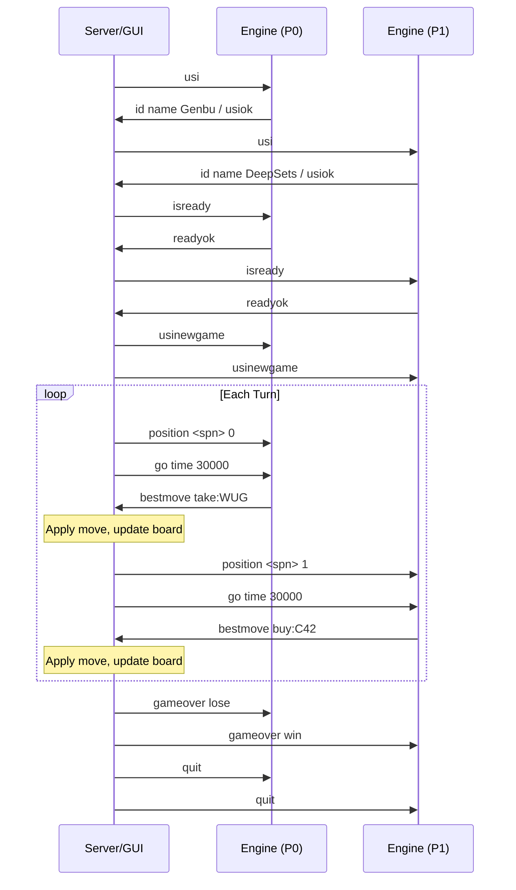

# USI Protocol Specification

**Version:** 1.0 Draft<br>
**Date:** 2026-02-11<br>
**Inspired by:** Universal Shogi Interface (USI) / Universal Chess Interface (UCI)

---

## 1. 概要

USI は、Splendor AI エンジンと GUI（または対局管理プログラム）間の**標準通信プロトコル**である。
将棋の USI プロトコルおよびチェスの UCI プロトコルを参考に設計されており、
異なる開発者が独自の AI を開発しても、共通のインターフェースで対局・評価を実行可能にすることを目的とする。

### 1.1 設計原則

1. **テキストベース**: 全通信は標準入力 (stdin) / 標準出力 (stdout) 経由の 7-bit ASCII テキスト。各コマンドは改行 `\n` で終端。
2. **ステートレスエンジン**: エンジンは `position` コマンドで完全な盤面情報を受信する。内部状態の整合性にエンジン側が依存しない。
3. **マルチプレイヤー対応**: 2〜4人対戦に対応。
4. **エンコーダ非依存**: アクション表記は人間可読な文字列（USI 記法）で行い、特定の ActionEncoder に依存しない。
5. **拡張可能**: `option` コマンドにより、エンジン固有のパラメータを柔軟に設定可能。

---

## 2. 宝石・色の表記

| 記号 | 宝石 | 英名 | GemType |
|------|------|------|---------|
| `W` | ダイヤモンド（白） | White / Diamond | `DIAMOND = 0` |
| `U` | サファイア（青） | Blue / Sapphire | `SAPPHIRE = 1` |
| `G` | エメラルド（緑） | Green / Emerald | `EMERALD = 2` |
| `R` | ルビー（赤） | Red / Ruby | `RUBY = 3` |
| `K` | オニキス（黒） | Black / Onyx | `ONYX = 4` |
| `D` | 金（ゴールド） | Gold | `GOLD = 5` |

> [!NOTE]
> 青を `U` としたのは `B` が黒 (Black) と混同しうるため。
> 黒を `K` としたのは `B` を避けるため。将棋 USI でも先後に `b/w` を使う慣例に倣い衝突を回避する。

---

## 3. アクション記法 (USI Move Notation)

全てのアクションは **1行のテキスト** で表現される。
各要素はハイフン `-` なしのワンワード、または `+` 区切りのサブパートで構成される。

### 3.1 宝石取得 (Take Gems)

```
take:<colors>[/return:<ret_colors>]
```

- `<colors>`: 取得する色を列挙（例: `WUG`, `RR`）
  - 3色異なる: `take:WUG`
  - 2色同色: `take:RR`
  - 銀行不足で2色以下: `take:WU`, `take:W`
- `/return:<ret_colors>`: 10枚超え時の返却（省略可）
  - 各色を列挙: `return:WRD`（W1, R1, D1 を返却）
  - 複数枚: `return:WW`（W を2枚返却）

**例:**
```
take:WUG                     → 白・青・緑を各1枚取得
take:RR                      → 赤を2枚取得
take:WUG/return:KK           → 白青緑を取得、黒2枚返却
take:RR/return:D             → 赤2枚取得、金1枚返却
```

### 3.2 カード予約 (Reserve)

```
reserve:C<card_id>[/return:<ret_colors>]
reserve:L<level>[/return:<ret_colors>]
```

- `C<card_id>`: 場のカードを指定（カードID 0-89）
- `L<level>`: デッキからの予約（レベル 1-3）

**例:**
```
reserve:C42                  → カードID42を予約（金トークン獲得）
reserve:L2                   → レベル2デッキから予約
reserve:C10/return:U         → カード10を予約、青を1枚返却
```

### 3.3 カード購入 (Purchase)

```
buy:C<card_id>[/gold:<gold_assignment>]
```

- `C<card_id>`: 購入するカードのID（場または予約手札から）
- `/gold:<gold_assignment>`: 金トークンの使い方（省略時 = 最小金使用）
  - 各色に対して金を何枚充当するかを `色=数` で列挙
  - 例: `gold:W1R2`（白に金1枚、赤に金2枚充当）

**例:**
```
buy:C3                       → カード3を購入（金は最小使用で自動決定）
buy:C71/gold:W2U1            → カード71を購入、金を白に2枚・青に1枚充当
buy:C0                       → カード0を購入（無料の場合も同形式）
```

> [!IMPORTANT]
> `/gold:` が省略された場合、エンジンは最小金使用（各色の不足分に最小限の金を充当）で購入したものとみなす。
> GUI 側がプレイヤーに支払いパターンを選ばせる場合は、明示的に `/gold:` を付与すること。

### 3.4 貴族訪問 (Visit Noble)

```
noble:N<noble_id>
```

**例:**
```
noble:N0                     → 貴族ID0を獲得
noble:N7                     → 貴族ID7を獲得
```

> [!NOTE]
> 貴族訪問は購入後に自動的に発生するが、複数候補がある場合はプレイヤーが選択する必要がある。
> エンジンは `bestmove buy:C42 noble:N3` のように購入と貴族を同一行で返すことができる。

### 3.5 パス (Pass)

```
pass
```

合法手が存在しない場合のみ使用可能。
`csplendor`では双方に通常の合法手がないことを確認した時点で引き分けとし、
無限のパス往復を防ぐ。

### 3.6 記法のBNF（簡略版）

```bnf
<move>        ::= <take> | <reserve> | <buy> | <noble> | "pass"
<take>        ::= "take:" <colors> [ "/return:" <ret> ]
<reserve>     ::= "reserve:" <card_or_deck> [ "/return:" <ret> ]
<buy>         ::= "buy:" <card_ref> [ "/gold:" <gold_assign> ] [ " " <noble> ]
<noble>       ::= "noble:" "N" <noble_id>
<card_or_deck>::= "C" <card_id> | "L" <level>
<card_ref>    ::= "C" <card_id>
<colors>      ::= <color>+
<ret>         ::= <color>+
<gold_assign> ::= ( <color> <digit> )+
<color>       ::= "W" | "U" | "G" | "R" | "K" | "D"
<card_id>     ::= [0-9]+           ; 0-89
<noble_id>    ::= [0-9]+           ; 0-11
<level>       ::= "1" | "2" | "3"
<digit>       ::= [0-9]
```

---

## 4. 盤面記法 (Splendor Position Notation: SPN)

盤面の完全な状態を表すテキスト表記。将棋の SFEN に相当する。

### 4.1 書式

```
<bank> | <visible> | <decks> | <nobles> | <player1> | <player2> [| <player3> | <player4>] <current_player>
```

各セクションはパイプ `|` で区切り、セクション内の要素はスペース区切り。

### 4.2 各セクション

#### Bank（場の宝石）
```
bank:W<n>U<n>G<n>R<n>K<n>D<n>
```
例: `bank:W4U4G4R4K4D5`

#### Visible Cards（場のカード）
```
visible:L1[<id>,<id>,<id>,<id>]L2[<id>,<id>,<id>,<id>]L3[<id>,<id>,<id>,<id>]
```
空スロットは `-` で表す。
例: `visible:L1[0,8,16,24]L2[40,46,52,58]L3[70,74,78,82]`

#### Decks（デッキ残数）
```
decks:<n1>,<n2>,<n3>
```
例: `decks:36,26,16`（レベル1に36枚、レベル2に26枚、レベル3に16枚）

#### Nobles（場の貴族）
```
nobles:[<id>,<id>,<id>]
```
例: `nobles:[0,3,7]`

#### Player State（各プレイヤー）
```
P<n>:gems:W<n>U<n>G<n>R<n>K<n>D<n>;bonuses:W<n>U<n>G<n>R<n>K<n>;points:<n>;reserved:[<id>,...];bought:[<id>,...]
```
- `gems`: 所持宝石
- `bonuses`: ボーナス（購入カードから獲得した永続宝石）
- `points`: 現在の勝利点
- `reserved`: 予約カードID（デッキ予約で非公開のカードは `?L<level>` で表記）
- `bought`: 購入済みカードID

例:
```
P0:gems:W1U2G0R0K1D0;bonuses:W0U1G0R0K0;points:0;reserved:[42,?L3];bought:[1]
```

#### Current Player
末尾に現在の手番プレイヤー番号を記載: `0`, `1`, `2`, `3`

### 4.3 SPN 完全例

```
bank:W3U2G4R4K3D5 | visible:L1[0,8,16,24]L2[40,46,52,58]L3[70,74,78,82] | decks:36,26,16 | nobles:[0,3,7] | P0:gems:W1U2G0R0K1D0;bonuses:W0U1G0R0K0;points:0;reserved:[];bought:[1] | P1:gems:W0U0G0R0K0D0;bonuses:W0U0G0R0K0;points:0;reserved:[];bought:[] 0
```

### 4.4 初期局面

将棋の `startpos` に相当する。プレイヤー数を引数で指定する。

```
position startpos <num_players>
```

カードの配置はランダムのため、初期局面の具体的な SPN は毎回異なる。
GUI 側がシードまたは具体的な SPN を指定する。

---

## 5. プロトコル コマンド

### 5.1 GUI → エンジン

| コマンド | 説明 |
|----------|------|
| `usi` | USI モード開始。エンジンは `id`, `option`, `usiok` で応答する。 |
| `isready` | 準備確認。エンジンは初期化完了後 `readyok` を返す。 |
| `setoption name <id> [value <x>]` | エンジンパラメータ設定。 |
| `usinewgame` | 新規対局開始。エンジンは内部状態をリセットする。 |
| `position <spn or startpos> [moves <m1> ... <mk>]` | 盤面設定。SPN または `startpos` + 手順で指定。 |
| `go [options]` | 思考開始。オプションで時間制限等を指定。 |
| `stop` | 思考中断。エンジンは即座に `bestmove` を返す。 |
| `gameover [win\|lose\|draw]` | 対局終了通知。 |
| `quit` | エンジン終了。 |

### 5.2 エンジン → GUI

| コマンド | 説明 |
|----------|------|
| `id name <engine_name>` | エンジン名。 |
| `id author <author_name>` | 作者名。 |
| `option name <id> type <type> [default <x>] [min <x>] [max <x>]` | 設定可能パラメータの宣言。 |
| `usiok` | USI モード初期化完了。 |
| `readyok` | 準備完了。 |
| `bestmove <move> [ponder <move>]` | 最善手。`ponder` は先読み予想手。 |
| `info <key> <value> ...` | 探索情報（評価値、読み筋、ノード数など）。 |

---

## 6. 通信フロー

### 6.1 初期化

```
GUI → Engine:  usi
Engine → GUI:  id name Genbu v2.0
Engine → GUI:  id author Kuboyu
Engine → GUI:  option name NumMCTSSims type spin default 1600 min 1 max 100000
Engine → GUI:  option name CPUCT type string default 2.5
Engine → GUI:  option name InferenceDevice type combo default cpu var cpu var cuda
Engine → GUI:  option name Temperature type string default 0.0
Engine → GUI:  option name NumThreads type spin default 1 min 1 max 128
Engine → GUI:  usiok
```

### 6.2 対局

```
GUI → Engine:  isready
Engine → GUI:  readyok

GUI → Engine:  usinewgame
GUI → Engine:  position bank:W4U4G4R4K4D5 | visible:L1[0,8,16,24]... | ... 0
GUI → Engine:  go time 30000
Engine → GUI:  info depth 12 nodes 1600 score cp 0.35 pv take:WUG buy:C42
Engine → GUI:  bestmove take:WUG

GUI → Engine:  position <updated_spn> 1
GUI → Engine:  go time 30000
Engine → GUI:  bestmove buy:C8/gold:R1

...

GUI → Engine:  gameover win
GUI → Engine:  quit
```

### 6.3 Ponder（先読み）

```
GUI → Engine:  go ponder
Engine → GUI:  (思考を続けてGUIからの次コマンドを待つ)

GUI → Engine:  ponderhit          (予想手が当たった場合、思考を継続)
           or
GUI → Engine:  stop               (予想手が外れた場合、思考中断)
Engine → GUI:  bestmove <move>
```

---

## 7. `go` コマンドのオプション

```
go [time <ms>] [nodes <n>] [depth <d>] [infinite] [ponder]
```

| オプション | 説明 |
|------------|------|
| `time <ms>` | 持ち時間（ミリ秒）。エンジンはこの時間内に `bestmove` を返す。 |
| `nodes <n>` | 探索ノード数上限。MCTS のシミュレーション回数に使用。 |
| `depth <d>` | 探索深度上限。 |
| `infinite` | 無限思考。`stop` を受信するまで思考を続ける。 |
| `ponder` | 先読みモード。 |
| `movetime <ms>` | 1手あたりの最大思考時間。 |

---

## 8. `info` コマンド

エンジンは思考中の情報を `info` で随時送信できる。

```
info depth <d> nodes <n> time <ms> score cp <v> pv <m1> <m2> ...
info string <任意の文字列>
```

| キー | 説明 |
|------|------|
| `depth` | 現在の探索深度。 |
| `nodes` | 探索ノード数。 |
| `time` | 思考経過時間（ミリ秒）。 |
| `score cp <v>` | 評価値（勝率を centipawn 的に表現: v ∈ [-10000, 10000]）。 |
| `score winrate <v>` | 勝率（0.0〜1.0）。 |
| `pv <moves>` | 読み筋（Principal Variation）。スペース区切りの手順。 |
| `string` | 自由テキスト（デバッグ用）。 |
| `multipv <k>` | マルチPV（上位 k 手の読み筋）。 |

---

## 9. `option` で推奨されるパラメータ

エンジン間の互換性のため、以下のパラメータ名を標準とする。

| name | type | 説明 | デフォルト例 |
|------|------|------|-------------|
| `NumMCTSSims` | spin | MCTS シミュレーション回数 | 1600 |
| `CPUCT` | string | MCTS の探索定数 | 2.5 |
| `Temperature` | string | 行動選択温度 (0.0 = greedy) | 0.0 |
| `InferenceDevice` | combo | 推論デバイス | cpu / cuda |
| `NumThreads` | spin | 探索スレッド数 | 1 |
| `ModelPath` | string | モデルファイルパス | — |
| `USI_Ponder` | check | Ponder 有効/無効 | false |

---

## 10. カードID・貴族ID リファレンス

### 10.1 カードID（0-89）

| ID 範囲 | レベル | ボーナス色 | 枚数 |
|---------|--------|------------|------|
| 0-7 | 1 | Sapphire (U) | 8 |
| 8-15 | 1 | Ruby (R) | 8 |
| 16-23 | 1 | Onyx (K) | 8 |
| 24-31 | 1 | Diamond (W) | 8 |
| 32-39 | 1 | Emerald (G) | 8 |
| 40-45 | 2 | Sapphire (U) | 6 |
| 46-51 | 2 | Ruby (R) | 6 |
| 52-57 | 2 | Onyx (K) | 6 |
| 58-63 | 2 | Diamond (W) | 6 |
| 64-69 | 2 | Emerald (G) | 6 |
| 70-73 | 3 | Sapphire (U) | 4 |
| 74-77 | 3 | Ruby (R) | 4 |
| 78-81 | 3 | Onyx (K) | 4 |
| 82-85 | 3 | Diamond (W) | 4 |
| 86-89 | 3 | Emerald (G) | 4 |

### 10.2 貴族ID（0-11）

| ID | 必要ボーナス | 点数 |
|----|------------|------|
| 0 | G4 R4 | 3 |
| 1 | R4 K4 | 3 |
| 2 | U4 G4 | 3 |
| 3 | W4 K4 | 3 |
| 4 | W4 U4 | 3 |
| 5 | W4 R4 | 3 |
| 6 | W3 R3 K3 | 3 |
| 7 | W3 U3 G3 | 3 |
| 8 | G3 R3 K3 | 3 |
| 9 | U3 G3 R3 | 3 |
| 10 | W3 U3 K3 | 3 |
| 11 | U3 G3 K3 | 3 |

---

## 11. 実装ガイドライン

### 11.1 エンジン開発者向け

1. **最小実装**: `usi`, `isready`, `position`, `go`, `bestmove`, `quit` の6コマンドを実装すれば対局が可能。
2. **アクション文字列のパース**: `take:`, `reserve:`, `buy:`, `noble:`, `pass` の5種類を認識するだけでよい。
3. **SPN パーサー**: `position` コマンドの SPN を受信して内部盤面を構築する。
4. **`/gold:` 省略時のデフォルト**: 最小金使用（csplendor の `_compute_gold_as` 相当）で自動決定。
5. **`info` は任意**: 探索情報の送信はオプショナルだが、GUIでの可視化に有用。

### 11.2 GUI 開発者向け

1. **エンジンプロセス管理**: エンジンを子プロセスとして起動し、stdin/stdout でパイプ接続する。
2. **SPN 生成**: 対局の各手番で盤面状態から SPN 文字列を生成して `position` コマンドで送信する。
3. **時間管理**: `go time <ms>` で思考時間を指定し、タイムアウト時に `stop` を送信する。
4. **複数エンジン対局**: 各プレイヤーに異なるエンジンを割り当て、GUI が `position` + `go` で交互に思考を要求する。

### 11.3 対局サーバー向け



---

## 12. 将棋 USI との対応表

| 将棋 USI | USI | 備考 |
|----------|-------------|------|
| SFEN | SPN | 盤面記法 |
| `position startpos` | `position startpos 2` | プレイヤー数を指定 |
| `position sfen ...` | `position <spn>` | SPN 文字列で盤面指定 |
| `7g7f` (手の表記) | `take:WUG`, `buy:C42` | アクション記法 |
| `resign` | （なし） | Splendor にリザインはない |
| `%KACHI` (入玉宣言勝ち) | （なし） | 該当なし |
| `btime/wtime` | `time` | プレイヤー共通の持ち時間 |

---

## 13. 今後の拡張（Reserved）

| 拡張 | 説明 | 優先度 |
|------|------|--------|
| `analyze` | 解析モード（対局なしで盤面評価） | 中 |
| `perft` | パフォーマンステスト（合法手生成速度計測） | 低 |
| `multipv` | 複数候補手の同時出力 | 中 |
| `book` | 序盤定跡データベース対応 | 低 |
| `eval` | 生の評価値（NN出力）の送信 | 中 |
| `policy` | NN ポリシー分布の送信（蒸留・分析用） | 高 |
| `nnue` | NNUE形式の評価関数対応 | 低 |

---

## Appendix A: 完全な対局ログ例

```
[Server]  usi
[Genbu]   id name Genbu v2.0
[Genbu]   id author Kuboyu
[Genbu]   option name NumMCTSSims type spin default 1600 min 1 max 100000
[Genbu]   usiok

[Server]  setoption name NumMCTSSims value 800
[Server]  isready
[Genbu]   readyok

[Server]  usinewgame
[Server]  position bank:W4U4G4R4K4D5 | visible:L1[2,11,18,27]L2[41,49,53,60]L3[71,75,79,84] | decks:36,24,12 | nobles:[1,5,9] | P0:gems:W0U0G0R0K0D0;bonuses:W0U0G0R0K0;points:0;reserved:[];bought:[] | P1:gems:W0U0G0R0K0D0;bonuses:W0U0G0R0K0;points:0;reserved:[];bought:[] 0
[Server]  go time 30000
[Genbu]   info depth 1 nodes 800 time 2341 score winrate 0.52 pv take:WUG take:RKG buy:C27
[Genbu]   bestmove take:WUG

[Server]  position bank:W3U3G3R4K4D5 | visible:L1[2,11,18,27]L2[41,49,53,60]L3[71,75,79,84] | decks:36,24,12 | nobles:[1,5,9] | P0:gems:W1U1G1R0K0D0;bonuses:W0U0G0R0K0;points:0;reserved:[];bought:[] | P1:gems:W0U0G0R0K0D0;bonuses:W0U0G0R0K0;points:0;reserved:[];bought:[] 1
[Server]  go time 30000
[Genbu]   bestmove take:RKG

[Server]  position ... 0
[Server]  go time 30000
[Genbu]   bestmove buy:C27
[Server]  position ... 1
[Server]  go time 30000
[Genbu]   bestmove reserve:C71

...

[Server]  gameover win
[Server]  quit
```
